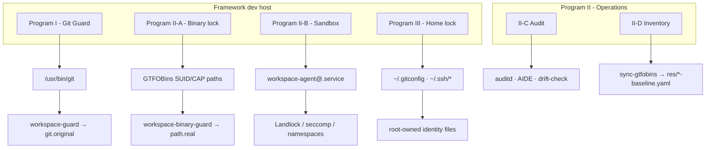

# Git and Host Guards for Coding Agents

Coding agents can skip hooks with `--no-verify`, force-push, rewrite history,
or edit git and ssh settings they should not touch.

**WORKSPACE-GUARD** wraps `git` and other privileged tools with compiled
guards that check each command before it runs, and locks the global config
paths agents must not change.

**Git Guard**, **System-Binary Lockdown**, and **Home-Dir Lock** cover git,
the system binary catalog, and home-directory identity files.

On a Linux agent host, run `make build-guard` and
`sudo make install-guard-host-exec` to deploy Git Guard; see **Host install**
below for optional programs. Full policy detail is in `docs/specifications/`.

---

## Role in the framework

| Surface | Git class | Install | Purpose |
|---------|-----------|---------|---------|
| Agent dev host (IDE shells, SSH) | `host-exec` | `make install-guard-host-exec` | **Primary** - real repos; non-PAM spawns need file caps on `/usr/bin/git` |
| Long-running agents under systemd | `sandbox-service` | `make install-sandbox` | Program II isolation; separate from git install |
| Podman Tier 2 / PRoot / macOS | none | `BUILD_MODE=root-only` in harness | CI soft barrier only; no host git guard |

Agent IDE terminals do not run PAM login, so ambient capabilities are
unavailable. **host-exec** delivers caps at file exec via `setcap` on
`/usr/bin/git`. See [SPEC-GIT-GUARD-DEPLOYMENT](docs/specifications/SPEC-GIT-GUARD-DEPLOYMENT.md).

---

## Host install

**Recommended** on agent dev hosts: one-shot stack (admin break-glass, fleet
user hardening, git/SSH identity, guard programs). See
[SPEC-HOST-PROVISION](docs/specifications/SPEC-HOST-PROVISION.md).

```bash
cp config/host-provision.yaml.example config/host-provision.yaml
cp config/home-lock-users.yaml.example config/home-lock-users.yaml
# edit locally ,  live files are gitignored

sudo make guard-up             # idempotent fleet bring-up (from workspace root)
# Or with a chosen admin password:
#   export WORKSPACE_ADMIN_PASSWORD='...' && sudo -E make guard-up
# Preflight (read-only): sudo make provision-host-preflight
make guard-check
sudo make install-hooks        # after git install, via WORKSPACE-CI
```

Phase 1 prints a one-time **admin** password; phase 2 prompts for it before
phase 3 fleet account setup. Fleet **sudo is never modified**. Mandatory audit:
**RED CRITICAL** if a provisioned fleet user exists and has sudo (group, sudoers,
or `sudo -l`); **YELLOW WARN** if the user exists without sudo. Unmanaged
direct-root sudoers grants block phase 3 until removed or acknowledged.

Operator commands: [docs/OPERATOR.md](docs/OPERATOR.md).

---

## Architecture



| Program | Surface | Enforcement | Install |
|---------|---------|-------------|---------|
| **I - Git Guard** | `/usr/bin/git` | Argument, config-key, and env policy; exec of `git.original` | `make install-guard-host-exec` |
| **II-A - Binary lock** | SUID and file-cap binaries (GTFOBins catalog) | Per-binary policy; non-root denied at public path | `make install-lock` |
| **II-B - Sandbox** | `workspace-agent@` services | Profile-based isolation (Landlock, seccomp, namespaces) | `make install-sandbox` |
| **II-C - Audit** | Guarded exec paths, baselines | auditd, AIDE, drift reports | `make install-auditd` |
| **II-D - Inventory** | Live host vs catalog | GTFOBins sync → `res/*-baseline.yaml` | `make sync-gtfobins` |
| **III - Home lock** | `~user/.gitconfig`, `~user/.ssh/*` (fleet list) | Root-owned paths; non-root cannot write | `make install-host-stack` or `provision-git-identities` + `install-home-lock` |
| **Host provision** | Admin account, fleet sudo audit, fleet UNIX users | Break-glass admin; RED/YELLOW fleet audit (no demotion) | `make provision-host` / `make install-host-stack` |

Programs compose on one host. Each has its own install target, spec, and
operational lifecycle.

---

## Program I - Git Guard

Replaces `/usr/bin/git` with a Rust guard that enforces repository policy before
delegating to `/usr/bin/git.original` (root-only, mode `0700`).

**Capability delivery:** see [Role in the framework](#role-in-the-framework).
File capabilities on `/usr/bin/git` (host-exec class). Installed class recorded at
`/usr/lib/workspace-guard/deployment-class` - source of truth for drift, check,
and runtime. Per-host binding: `config/guard-host-profiles.yaml` (`hostname -s` →
class).

**Policy scope:**

- Subcommand blocks: `reset`, `clean`, `restore`, `rebase`, `gc`, and related
  destructive operations; sudo-gated `checkout` / `submodule`; flag gates on
  `--hard`, `--no-verify`, force push, `--amend`, protected-branch pull/merge.
- 96 glob patterns on `-c` / `--config` / `--config-env` keys.
- Closed child environment (18-variable allow-list, hardcoded `PATH`).
- Per-repo `.git/` ownership lock in host-exec mode.
- WORKSPACE-CI quality contract on commit and push.

**Exit codes:** `0` success · `1` policy block · `2` infrastructure · `4` contract
failure. Blocks are audited to `~/.workspace-guard.log` and `/dev/tty`.

| Document | Content |
|----------|---------|
| [SPEC-GIT-GUARD](docs/specifications/SPEC-GIT-GUARD.md) | Policy engine, rules, config keys |
| [SPEC-GIT-GUARD-DEPLOYMENT](docs/specifications/SPEC-GIT-GUARD-DEPLOYMENT.md) | Install classes, host profiles, drift |
| [SPEC-GIT-GUARD-HARDENING](docs/specifications/SPEC-GIT-GUARD-HARDENING.md) | `.git` lock, threat model |
| [ROOT-ONLY-MODE](docs/ROOT-ONLY-MODE.md) | Root-only build for CI / containers |

---

## Program II - System surface

### Binary lock

`workspace-binary-guard` is built once and installed at each contained path.
At runtime it resolves policy from `basename(argv[0])`, validates arguments and
environment, and either blocks or `execve()`s `<path>.real`. Policies are
compile-time baked from `config/binary-policy-rules.yaml` and
`res/binary-lock.yaml` (generated by sync).

Typical dispositions: `deny-non-root`, `deny-all-non-root`, `arg-validate` (e.g.
`sudo`, `passwd`), `pass-through` for vetted helpers.

### Sandbox

Per-host profile from `config/sandbox/profiles.yaml` materialises into
`workspace-agent@.service`: capability bounding set, `NoNewPrivileges`, seccomp,
and optional Landlock / gVisor / Firecracker tiers for long-running agents.

### Audit and inventory

- `make sync-gtfobins` - fetch GTFOBins and konstruktoid, match live SUID/CAP
  surface, emit `res/suid-baseline.yaml`, `res/fcap-baseline.yaml`,
  `res/binary-lock.yaml`, `res/cve-catalog.yaml`.
- `make drift-check` - compare live host to committed baselines; exit non-zero on
  CRITICAL drift.
- `make install-auditd` - deploy `config/auditd/99-workspace-guard.rules` and
  AIDE configuration.

| Document | Content |
|----------|---------|
| [SPEC-BINARY-LOCK](docs/specifications/SPEC-BINARY-LOCK.md) | Contain-via-guard procedure |
| [SPEC-SANDBOX](docs/specifications/SPEC-SANDBOX.md) | Profiles and systemd unit |
| [SPEC-AUDIT](docs/specifications/SPEC-AUDIT.md) | auditd and integrity monitoring |
| [SPEC-CAP-THROTTLE](docs/specifications/SPEC-CAP-THROTTLE.md) | Capability allowlists |
| [RESEARCH-SYSTEM-BINARIES](docs/RESEARCH-SYSTEM-BINARIES.md) | CVE catalog and layer rationale |

---

## Program III - Home directory lock

Locks user-global git and SSH identity files by transferring ownership to root.
Agents cannot open `~/.gitconfig` or `~/.ssh/authorized_keys` for write; per-repo
`.git/config` is already covered by Program I. Paths and modes are defined in
`config/guard_locked_paths.yaml`.

```bash
sudo make install-home-lock
make home-drift-check
```

| Document | Content |
|----------|---------|
| [SPEC-HOME-LOCK](docs/specifications/SPEC-HOME-LOCK.md) | Install, uninstall, drift |
| [REQ-HOME-LOCK](docs/requirements/REQ-HOME-LOCK.md) | Requirements (`REQ-HL-*`) |

---

## Building and testing

Crate and harness development for WORKSPACE-GUARD itself (not guard install on
dev hosts - see [Host install](#host-install)).

```bash
make check-push        # fmt, clippy, check, cargo test, host-provision Podman E2E
make test-shell        # bats suite (scripts and helpers)
make test-podman-provision # host-provision E2E only (also in check-push on Linux)
make test-podman-quick # Podman tiers 0-2
make test-podman       # + Tier 3 host-exec E2E
make test-qemu-guest   # Authoritative host-exec E2E in QEMU guest
```

```bash
cargo build --release
cargo build --release --no-default-features --features root-only
make lint
make sync-gtfobins-linux   # Regenerate baselines inside Linux container
```

macOS hosts use `make init` and the Podman harness for Linux-kernel tests.
See [SPEC-PODMAN-TESTING](docs/specifications/SPEC-PODMAN-TESTING.md).

---

## Requirements and specifications

| Area | Requirements | Specifications |
|------|--------------|----------------|
| Git guard | [REQ-GIT-GUARD](docs/requirements/REQ-GIT-GUARD.md) | [SPEC-GIT-GUARD](docs/specifications/SPEC-GIT-GUARD.md), [SPEC-GIT-GUARD-IMPL](docs/specifications/SPEC-GIT-GUARD-IMPL.md), [SPEC-GIT-GUARD-DEPLOYMENT](docs/specifications/SPEC-GIT-GUARD-DEPLOYMENT.md) |
| System surface | [REQ-SANDBOX](docs/requirements/REQ-SANDBOX.md) | [SPEC-BINARY-LOCK](docs/specifications/SPEC-BINARY-LOCK.md), [SPEC-SANDBOX](docs/specifications/SPEC-SANDBOX.md), [SPEC-AUDIT](docs/specifications/SPEC-AUDIT.md) |
| Home lock | [REQ-HOME-LOCK](docs/requirements/REQ-HOME-LOCK.md) | [SPEC-HOME-LOCK](docs/specifications/SPEC-HOME-LOCK.md) |
| Host provision | ,  | [SPEC-HOST-PROVISION](docs/specifications/SPEC-HOST-PROVISION.md) |
| Podman / QEMU testing | [REQ-PODMAN-TESTING](docs/requirements/REQ-PODMAN-TESTING.md) | [SPEC-PODMAN-TESTING](docs/specifications/SPEC-PODMAN-TESTING.md) |

Canonical reference sources: [docs/references/SOURCES.md](docs/references/SOURCES.md).

---

## License

Internal. Independent AI Labs.