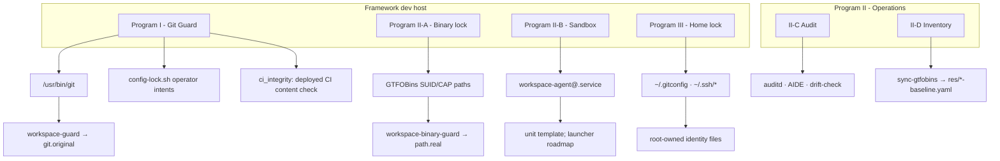

# WORKSPACE-GUARD

WORKSPACE-GUARD is a fail-closed, compiled-in-Rust policy layer that guards
the git interface and hardens the surrounding host surface on agent dev
machines.

It is organized into four deployed programs:

1. **Program I - Git Guard.** Replaces `/usr/bin/git` and execs the real
   binary (`/usr/bin/git.original`, root-only, mode `0700`) only after
   argument, configuration-key, and environment checks pass. It root-locks
   `.git/`, enforces forward-only history, and delegates hook-based quality
   checks to WORKSPACE-CI.
2. **Program II-A - Binary Lock.** Contains GTFOBins-class SUID and
   file-capability binaries behind per-binary policy wrappers
   (`workspace-binary-guard` at each contained path, exec of `<path>.real`).
3. **Program II-C/D - Audit and Inventory.** Maintains live baselines against
   GTFOBins and konstruktoid catalogs, runs drift checks against them, and
   deploys auditd and AIDE rules.
4. **Program III - Home Lock.** Root-locks `~/.gitconfig`, `~/.ssh/*`, and
   declared config globs inside fleet accounts.

Program II-B - Sandbox is roadmap: a hardened systemd unit template ships,
but the launcher binary that would apply Landlock, seccomp, and namespace
isolation is not yet built.

Enforcement rests on three ideas:

1. **Forward-only history.** Agents cannot rewrite, revert, restore, clean,
   stash-drop, force-push, or bypass hooks (`--no-verify`). `git commit
   --amend` is available only to operators via sudo.
2. **Scoped root-locking.** Program I root-locks `.git/` inside workspace
   repos and provisioned-host clones; Program III root-locks user-global
   identity files and declared config globs. Locks are not applied to
   temporary sandboxes outside these scopes.
3. **Operator intent.** Root-owned config files can be temporarily unsealed
   with `config-lock.sh unseal`, edited, and re-locked. The guard honors the
   unseal state across invocations and fails closed when the state file is
   absent or unreadable.

Blocks are audited to `~/.workspace-guard.log` and `/dev/tty`. Full policy
detail is in `docs/specifications/`; operator workflow in
[docs/OPERATOR.md](docs/OPERATOR.md).

---

## What this repo covers

| Surface | Program | Status | Install |
|---------|---------|--------|---------|
| Git wrapper | **I - Git Guard** | Deployed | `sudo make reconcile-guard-host-exec` |
| SUID and file-cap binaries | **II-A - Binary lock** | Deployed | `make install-lock` |
| Long-running agents under systemd | **II-B - Sandbox** | Roadmap: unit template shipped, launcher not built | `make install-sandbox` (unit only) |
| Audit and inventory | **II-C + II-D** | Deployed | `make install-auditd`, `make sync-gtfobins` |
| Home-directory identity files | **III - Home lock** | Deployed | `make install-home-lock` |

Programs compose on one host. Each has its own install target, spec, and
operational lifecycle.

---

## Execution classes

| Class | Mechanism | Use |
|-------|-----------|-----|
| `host-exec` | File capabilities on `/usr/bin/git` via `setcap` | **Primary.** Agent dev hosts; IDE terminals do not run PAM login, so ambient caps are unavailable |
| `sandbox-service` | systemd `AmbientCapabilities` on `workspace-agent@` | Program II-B runtime only; installed by `make install-sandbox`, never by git install |
| `root-only` | `BUILD_MODE=root-only` in the harness | CI soft barrier (Podman Tier 2 / PRoot / macOS); no host git guard |

The installed class is recorded at `/usr/lib/workspace-guard/deployment-class`,
which is the source of truth for drift, check, and runtime. Per-host binding:
`config/guard-host-profiles.yaml` (`hostname -s` to class). See
[SPEC-GIT-GUARD-DEPLOYMENT](docs/specifications/SPEC-GIT-GUARD-DEPLOYMENT.md).

---

## Architecture



---

## Security properties

Invariants enforced by the current code:

- Privilege delivery via SUID/file-cap exec; the guard refuses to run without
  a secure exec context (`AT_SECURE`), exit code 3.
- Deny-list policy engine. Exit codes: `0` success, `1` policy block,
  `2` infrastructure, `4` contract failure.
- Closed child environment: fixed allow-list of variables and hardcoded
  `PATH`.
- Config-key glob deny list on `-c` / `--config` / `--config-env`
  (`config/guard_policy_matrix.yaml`).
- `RLIMIT_NOFILE` clamp on guard children (4096, from
  `config/guard_resource_limits.yaml`).
- `git fetch` refspecs restricted to ref names; arbitrary URL refspecs are
  blocked.
- `.git/` ownership lock scoped to workspace repos and clones whose remotes
  point at provisioned hosts; everything else is untouched.
- Workspace detection fails closed: incomplete workspace markers or a
  workspace clone outside the workspace tree block enforcement bypass.
- CI deployment integrity is verified by content, not just ownership
  (`src/ci_integrity.rs`).
- Provisioned SSH key material is kept off agent-readable disk and offered
  through the guard-managed ssh wrapper (`config/git_ssh_allowlist.yaml`).

---

## Program I - Git Guard

Replaces `/usr/bin/git` with a Rust guard that enforces repository policy
before delegating to `git.original`.

**Policy scope:**

- Subcommand blocks: `reset`, `clean`, `restore`, `rebase`, `gc`, and related
  destructive operations; sudo-gated `checkout` / `submodule`; flag gates on
  `--hard`, `--no-verify`, force push, protected-branch pull/merge; `--amend`
  sudo-gated.
- Config-key glob deny list on `-c` / `--config` / `--config-env`.
- Closed child environment; capability flow keeps policy sub-calls
  least-privilege (no ambient caps) while the final exec path raises only
  `CAP_DAC_OVERRIDE`.
- Per-repo `.git/` ownership lock in host-exec mode, scoped as described in
  [Security properties](#security-properties).
- WORKSPACE-CI quality contract on commit and push.

**Config lock and CI integrity:**

- `scripts/config-lock.sh` gives operators a timed unseal over root-owned
  consumer config globs (`config/*.yaml` exception files). `unseal` records
  the released file list inside the root-owned `.git/` tree; the guard reads
  that state and skips exactly those paths during its per-invocation glob
  relock. `lock`/`relock` restore full enforcement.
- `ci_integrity` verifies that deployed WORKSPACE-CI mirror content matches
  the expected tree, so an agent-modified deployment is detected even when
  file ownership still looks correct.

| Document | Content |
|----------|---------|
| [SPEC-GIT-GUARD](docs/specifications/SPEC-GIT-GUARD.md) | Policy engine, rules, config keys |
| [SPEC-GIT-GUARD-DEPLOYMENT](docs/specifications/SPEC-GIT-GUARD-DEPLOYMENT.md) | Install classes, host profiles, drift |
| [SPEC-GIT-GUARD-HARDENING](docs/specifications/SPEC-GIT-GUARD-HARDENING.md) | `.git` lock, unseal flow, capability flow, threat model |

---

## Program II - System surface

### II-A Binary lock

`workspace-binary-guard` is built once and installed at each contained path.
At runtime it resolves policy from `basename(argv[0])`, validates arguments
and environment, and either blocks or `execve()`s `<path>.real`. Policies are
compile-time baked from `config/binary-policy-rules.yaml` and
`res/binary-lock.yaml` (generated by sync).

Typical dispositions: `deny-non-root`, `deny-all-non-root`, `arg-validate`
(for example `sudo`, `passwd`), `pass-through` for vetted helpers.

### II-B Sandbox (roadmap)

`config/systemd/workspace-agent@.service` ships the hardened unit template
(capability bounding set, `NoNewPrivileges`, seccomp filter, address-family
restriction, `PrivateDevices`, resource limits), and `make install-sandbox`
installs it. The unit's `ExecStart` launcher
(`/usr/local/bin/workspace-sandbox-launcher`) is not built yet, so the unit
cannot be started. Do not run `install-sandbox` on IDE-shell hosts.

### II-C Audit and II-D Inventory

- `make sync-gtfobins`: fetch GTFOBins and konstruktoid, match live SUID/CAP
  surface, emit `res/suid-baseline.yaml`, `res/fcap-baseline.yaml`,
  `res/binary-lock.yaml`, `res/cve-catalog.yaml`.
- `make drift-check`: compare live host to committed baselines; exit non-zero
  on CRITICAL drift.
- `make install-auditd`: deploy `config/auditd/99-workspace-guard.rules` and
  AIDE configuration.

| Document | Content |
|----------|---------|
| [SPEC-BINARY-LOCK](docs/specifications/SPEC-BINARY-LOCK.md) | Contain-via-guard procedure |
| [SPEC-SANDBOX](docs/specifications/SPEC-SANDBOX.md) | Profiles and systemd unit |
| [SPEC-AUDIT](docs/specifications/SPEC-AUDIT.md) | auditd and integrity monitoring |
| [SPEC-CAP-THROTTLE](docs/specifications/SPEC-CAP-THROTTLE.md) | Capability allowlists |
| [RESEARCH-SYSTEM-BINARIES](docs/RESEARCH-SYSTEM-BINARIES.md) | CVE catalog and layer rationale |

---

## Program III - Home directory lock

Locks user-global git and SSH identity files by transferring ownership to
root. Agents cannot open `~/.gitconfig` or `~/.ssh/authorized_keys` for write;
per-repo `.git/config` is already covered by Program I. Paths and modes are
defined in `config/guard_locked_paths.yaml`, which declares four categories:
recursive tree paths, recursive tree globs, individual files, and filename
globs.

```bash
sudo make install-home-lock
make home-drift-check
```

| Document | Content |
|----------|---------|
| [SPEC-HOME-LOCK](docs/specifications/SPEC-HOME-LOCK.md) | Install, uninstall, drift |
| [REQ-HOME-LOCK](docs/requirements/REQ-HOME-LOCK.md) | Requirements (`REQ-HL-*`) |

---

## Host install

**Recommended** on agent dev hosts: one-shot stack (admin break-glass, fleet
user hardening, git/SSH identity, guard programs). See
[SPEC-HOST-PROVISION](docs/specifications/SPEC-HOST-PROVISION.md).

```bash
cp config/host-provision.yaml.example config/host-provision.yaml
cp config/home-lock-users.yaml.example config/home-lock-users.yaml
# edit locally; live files are gitignored

sudo make guard-up             # idempotent fleet bring-up (from workspace root)
# Or with a chosen admin password:
#   export WORKSPACE_ADMIN_PASSWORD='...' && sudo -E make guard-up
# Preflight (read-only): sudo make provision-host-preflight
make guard-check
sudo make install-hooks        # root: .git/hooks is root-owned in host-exec
```

For a guard code change, force a rebuild and reinstall; the plain install is
drift-aware and may skip a stale binary:

```bash
sudo make reconcile-guard-host-exec
```

If `make build-guard` was run as root, `target/` is left root-owned and later
agent runs of cargo fail; hand it back with
`sudo chown -R "$(id -u):$(id -g)" target/`.

Phase 1 of provisioning prints a one-time **admin** password; phase 2 prompts
for it before phase 3 fleet account setup. Fleet **sudo is never modified**.
Mandatory audit: **RED CRITICAL** if a provisioned fleet user exists and has
sudo (group, sudoers, or `sudo -l`); **YELLOW WARN** if the user exists
without sudo. Unmanaged direct-root sudoers grants block phase 3 until removed
or acknowledged.

### Operator commands

Run from the workspace root; full detail in
[docs/OPERATOR.md](docs/OPERATOR.md).

| Command | Purpose |
|---------|---------|
| `sudo make guard-up` | Idempotent bring-up (provision plus guard install as needed) |
| `sudo make guard-refresh` | Reinstall after pulling guard code (alias `refresh-guard`) |
| `make guard-check` | Read-only health check |
| `sudo make guard-down` | Remove git guard only (provision state preserved) |
| `sudo GUARD_PURGE_CONFIRM=1 make guard-reset` | Factory reset then bring-up |
| `scripts/config-lock.sh unseal <repo> [minutes]` | Temporarily release root-owned config files |
| `scripts/config-lock.sh relock <repo>` | Restore config locks now |

---

## Building and testing

Crate and harness development for WORKSPACE-GUARD itself (not guard install on
dev hosts; see [Host install](#host-install)).

```bash
make check-push        # fmt, clippy, check, cargo test, host-provision Podman E2E
make test-shell        # bats suite (scripts and helpers)
make test-podman-provision # host-provision E2E only (also in check-push on Linux)
make test-podman-quick # Podman tiers 0-2
make test-podman       # + Tier 3 host-exec E2E
make test-qemu-guest   # Authoritative host-exec E2E in QEMU guest
```

```bash
cargo build --release
cargo build --release --no-default-features --features root-only
make lint
make sync-gtfobins-linux   # Regenerate baselines inside Linux container
```

macOS hosts use `make init` and the Podman harness for Linux-kernel tests.
See [SPEC-PODMAN-TESTING](docs/specifications/SPEC-PODMAN-TESTING.md).

---

## Requirements and specifications

| Area | Requirements | Specifications |
|------|--------------|----------------|
| Git guard | [REQ-GIT-GUARD](docs/requirements/REQ-GIT-GUARD.md) | [SPEC-GIT-GUARD](docs/specifications/SPEC-GIT-GUARD.md), [SPEC-GIT-GUARD-IMPL](docs/specifications/SPEC-GIT-GUARD-IMPL.md), [SPEC-GIT-GUARD-DEPLOYMENT](docs/specifications/SPEC-GIT-GUARD-DEPLOYMENT.md) |
| System surface | [REQ-SANDBOX](docs/requirements/REQ-SANDBOX.md) | [SPEC-BINARY-LOCK](docs/specifications/SPEC-BINARY-LOCK.md), [SPEC-SANDBOX](docs/specifications/SPEC-SANDBOX.md), [SPEC-AUDIT](docs/specifications/SPEC-AUDIT.md) |
| Home lock | [REQ-HOME-LOCK](docs/requirements/REQ-HOME-LOCK.md) | [SPEC-HOME-LOCK](docs/specifications/SPEC-HOME-LOCK.md) |
| Host provision | n/a | [SPEC-HOST-PROVISION](docs/specifications/SPEC-HOST-PROVISION.md) |
| Podman / QEMU testing | [REQ-PODMAN-TESTING](docs/requirements/REQ-PODMAN-TESTING.md) | [SPEC-PODMAN-TESTING](docs/specifications/SPEC-PODMAN-TESTING.md) |

Canonical reference sources: [docs/references/SOURCES.md](docs/references/SOURCES.md).

---

## License

Internal. Independent AI Labs.
