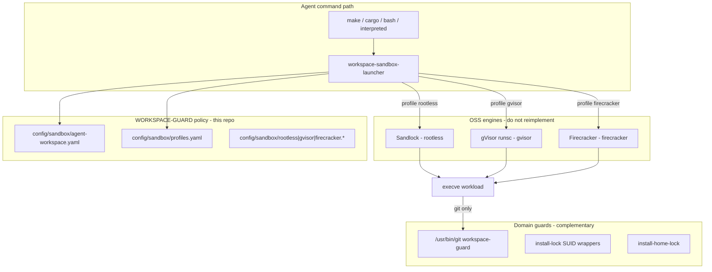

# Specification: Sandbox Stack (Standard Engine Integration)

**Date:** 2026-07-14
**Status:** DRAFT
**Type:** Specification
**Requirements:** [REQ-SANDBOX](../requirements/REQ-SANDBOX.md)
**Threat Model:** [RESEARCH-SYSTEM-BINARIES](../RESEARCH-SYSTEM-BINARIES.md)
**Gap analysis:** [GAP-ANALYSIS-HARD-NUKE](../GAP-ANALYSIS-HARD-NUKE.md)

---

## 1. Purpose and scope

Program II-B confines **untrusted agent shell and build commands** (`make`,
`cargo`, `bash`, `interpreted runtime`, …) before they reach the host kernel or block
devices. It does **not** replace Programs I, II-A, or III:

| Program | Role | Stays after sandbox deploy |
|---------|------|----------------------------|
| **I ,  Git guard** | Git argv/config/env policy, WORKSPACE-CI contract | Yes ,  runs inside sandbox via bind-mounted `/usr/bin/git` |
| **II-A ,  Binary lock** | Host SUID/CAP wrappers, CVE arg rules | Yes ,  host defense when launcher is bypassed |
| **II-B ,  Sandbox** (this spec) | Per-command process isolation | New ,  closes `/dev/sda` class gaps |
| **III ,  Home lock** | Root-owned `~/.gitconfig`, `~/.ssh/*` | Yes ,  host inode policy outside sandbox |

WORKSPACE-GUARD does **not** implement Landlock, seccomp BPF, namespace
setup, or a userspace kernel. Those come from **standard OSS engines**.
This repo ships a thin launcher, YAML policy, and install wiring only.

---

## 2. Architecture



**Invocation:**

```
workspace-sandbox-launcher --profile <name|auto> -- <command> [args...]
```

| Profile | Engine | Binary | License | Cold start |
|---------|--------|--------|---------|------------|
| `rootless` | [Sandlock](https://github.com/multikernel/sandlock) | `sandlock` | Apache 2.0 | ~6 ms |
| `gvisor` | [gVisor](https://github.com/google/gvisor) | `runsc` | Apache 2.0 | ~200 ms |
| `firecracker` | [Firecracker](https://github.com/firecracker-microvm/firecracker) | `firecracker` | Apache 2.0 | ~125 ms |

Tier selection follows [RESEARCH-SYSTEM-BINARIES](../RESEARCH-SYSTEM-BINARIES.md)
section 4: rootless for routine IDE work; gVisor for untrusted LLM one-shots;
Firecracker when host compromise cost is catastrophic.

---

## 3. `workspace-sandbox-launcher`

### 3.1 Responsibility

The launcher is a **thin delegator** (target ~200-400 lines Rust or bash).
It MUST NOT install seccomp filters, Landlock rules, or namespaces itself.

| Launcher duty | Owner |
|---------------|-------|
| Parse `--profile` and `--` separator | Launcher |
| Resolve `auto` via `config/sandbox/profiles.yaml` | Launcher ([scripts/lib/sandbox-profile.sh](../../scripts/lib/sandbox-profile.sh)) |
| Load `config/sandbox/agent-workspace.yaml` | Launcher |
| Expand `${WORKSPACE}`, `${HOME}`, `${USER}` in policy paths | Launcher |
| Translate policy → engine invocation | Launcher |
| Exec `sandlock` / `runsc` / `firecracker` | Engine |
| `waitpid`, map exit code, append launch log | Launcher |

Install path: `/usr/local/bin/workspace-sandbox-launcher` (same path referenced
by [config/systemd/workspace-agent@.service](../../config/systemd/workspace-agent@.service)).

Build target (Makefile): `build-sandbox-launcher` copies or compiles the
launcher; `install-sandbox` installs unit + launcher + policy files.

### 3.2 CLI

```
Usage: workspace-sandbox-launcher --profile <name|auto> -- <command> [args...]

Profiles:
  rootless     Sandlock ,  daily agent commands on shared kernel
  gvisor       gVisor runsc ,  untrusted / high-risk commands
  firecracker  Firecracker microVM ,  maximum isolation
  auto         First match in config/sandbox/profiles.yaml on hostname -s
```

| Exit code | Meaning |
|-----------|---------|
| 0 | Workload exit 0 |
| 1-255 | Workload exit code propagated |
| 2 | Missing/invalid profile, bad CLI, `auto` no match |
| 3 | Engine or policy setup failed ,  **workload NOT started** |
| 127 | Required engine binary not found |

### 3.3 Fail-closed rule

If Sandlock, runsc, or Firecracker fails to start, or policy translation
fails, the launcher exits **3** and does **not** exec the workload
unconfined. Satisfies REQ-SBX-141.

---

## 4. Policy configuration

All framework-specific rules live in YAML under `config/sandbox/`. Engines
consume translated forms; policy is reviewed in git, not hardcoded in the
launcher.

### 4.1 `config/sandbox/agent-workspace.yaml`

Host-wide confinement policy. The launcher maps this file to Sandlock policy
for `rootless`; gVisor/Firecracker use the filesystem and network sections
for bind mounts and `--network` flags.

See [config/sandbox/agent-workspace.yaml](../../config/sandbox/agent-workspace.yaml).

| Section | Purpose |
|---------|---------|
| `landlock.allow_read` | Paths readable inside sandbox |
| `landlock.allow_write` | Paths writable inside sandbox |
| `landlock.deny` | Explicit deny (`/dev`, `/sys/block`, `/boot`, …) |
| `network.default` | `none` \| `host` |
| `network.http` | Optional Sandlock HTTP ACLs (method/host/path) |
| `bind_mounts` | Workspace and toolchain paths into gVisor/Firecracker |
| `resources` | Memory, CPU, pids ,  overrides per-profile tunables |

**Block-device rule (mandatory):** `/dev`, `/sys/block`, and `/dev/disk`
MUST appear in `landlock.deny`. Sandlock deny-by-default blocks everything
else not allow-listed, including `/dev/sda` and `/dev/nvme*`.

### 4.2 `config/sandbox/profiles.yaml`

Hostname → profile. First regex match wins. Used only when
`--profile auto`. Algorithm: [scripts/lib/sandbox-profile.sh](../../scripts/lib/sandbox-profile.sh).

### 4.3 Per-profile tunables

| File | Engine | Contents |
|------|--------|----------|
| [config/sandbox/rootless.yaml](../../config/sandbox/rootless.yaml) | Sandlock | memory, CPU, pids, `net_host` → Sandlock network mode |
| [config/sandbox/gvisor.yaml](../../config/sandbox/gvisor.yaml) | runsc | `platform`, `network`, debug flags |
| `config/sandbox/firecracker.json` | Firecracker | guest kernel, rootfs, vCPU, memory |

`make install-sandbox` validates that every profile named in `profiles.yaml`
has a matching tunable file.

---

## 5. Profile: `rootless` (Sandlock)

### 5.1 Principle

The rootless profile **delegates entirely to Sandlock**. WORKSPACE-GUARD
does not maintain a hand-rolled Landlock/seccomp/namespace implementation.

Sandlock provides (per [references/sandlock-arxiv.html](../references/sandlock-arxiv.html)):

- Landlock filesystem ACLs and deny-by-default paths
- seccomp-bpf with optional seccomp-user-notify supervisor
- User, mount, network, PID namespaces
- `PR_SET_NO_NEW_PRIVS`
- Optional `policy_fn` for runtime argv-based decisions
- Optional HTTP-level network ACLs
- Copy-on-write workspace (BranchFS) for reversible agent writes

REQ-SBX-110 through REQ-SBX-116 are satisfied **by Sandlock** when the
generated policy includes the workspace template in section 4.1 and the
CVE syscall set in section 5.3.

### 5.2 Launcher → Sandlock command

```
sandlock run \
  --policy /etc/workspace-guard/sandlock-policy.json \
  -- <command> [args...]
```

At install time the launcher renders
`/etc/workspace-guard/sandlock-policy.json` from
`agent-workspace.yaml` + `rootless.yaml`. The render step is the only
custom code; the enforcement engine is Sandlock.

### 5.3 Required Sandlock policy content

The rendered policy MUST include at minimum:

**Filesystem (Landlock):**

| Path | Read | Write |
|------|------|-------|
| `/etc` | yes | no |
| `/etc/shadow`, `/etc/gshadow` | no | no |
| `/usr`, `/bin`, `/sbin`, `/lib`, `/lib64` | yes | no |
| `/boot` | no | no |
| `/root`, `/root/.ssh` | no | no |
| `${WORKSPACE}` | yes | yes |
| `/tmp` | yes | yes |
| `~/.ssh` | no | no |
| `/dev`, `/sys/block` | no | no |

**Syscalls (seccomp):** deny at least the set in REQ-SBX-111 plus
`socket(AF_ALG)` per REQ-SBX-112. Sandlock's default agent-oriented
profiles meet this; the render step MUST NOT weaken them.

**Resources:** from `rootless.yaml` ,  `memory_max`, `cpu_quota`, `pids_max`,
`rlimits` (RLIMIT_CORE=0, RLIMIT_NOFILE=256).

**Network:** loopback only unless `net_host: true` in `rootless.yaml`.

### 5.4 Optional Sandlock features

| Feature | When to enable |
|---------|----------------|
| `policy_fn` / stage hooks | `npm install` then test with tighter network |
| HTTP ACLs | Restrict agent egress to package registries |
| COW workspace | Dry-run agent edits before commit to disk |

These are configured in `agent-workspace.yaml` under `stages:` and
`network.http` when needed. Default vm-ws deploy leaves them off.

### 5.5 Git guard inside Sandlock

Bind-mount host paths into the Sandlock mount namespace:

- `/usr/bin/git` (workspace-guard)
- `/usr/bin/git.original` (mode 0700 ,  visible only if caps allow)
- Workspace tree

`git` invocations from inside the sandbox still hit Program I policy.
Sandlock does not parse git argv.

---

## 6. Profile: `gvisor` (runsc)

### 6.1 Principle

Delegate to `runsc`. No custom Sentry or syscall interception in this repo.

### 6.2 Launcher → runsc command

```
runsc \
  --root=/var/run/workspace-guard/runsc \
  --platform=<platform> \
  --network=<network> \
  --no-new-privs \
  run \
  --bundle=<generated-oci-bundle> \
  -- <command> [args...]
```

`<platform>` and `<network>` come from [config/sandbox/gvisor.yaml](../../config/sandbox/gvisor.yaml).

### 6.3 OCI bundle generation

The launcher generates a minimal OCI bundle per invocation:

- **Root filesystem:** read-only host `/usr` + bind-mount `${WORKSPACE}` rw
- **Mounts:** same deny intent as section 5.3 ,  no `/dev` block nodes in bundle
- **Network:** `none` default; `host` only when config allows
- **Capabilities:** empty set
- **NoNewPrivileges:** true

REQ-SBX-120 through REQ-SBX-122 satisfied by runsc.

### 6.4 When to use

Hostname pattern `.*-untrusted` or explicit `--profile gvisor` for
LLM-generated one-liners, curl-to-bash, or unknown package scripts.
Not for every `git status` ,  latency cost per [RESEARCH.md](../../RESEARCH.md) §5.2.

---

## 7. Profile: `firecracker` (microVM)

### 7.1 Principle

Delegate to the Firecracker VMM. No custom VMM code in this repo.

### 7.2 Launcher → Firecracker command

```
firecracker --no-api --config-file <generated-config.json>
```

Base template: `config/sandbox/firecracker.json`. Launcher patches:

- Bind-mount workspace into guest via virtio-fs or pre-built rootfs overlay
- `vcpu_count`, `mem_size_mib` from `agent-workspace.yaml` `resources`
- Empty `network-interfaces` unless explicitly enabled

### 7.3 Guest artifacts

| Artifact | Path | Maintained by |
|----------|------|---------------|
| Guest kernel | `config/sandbox/vmlinux` | `make fetch-sandbox-artifacts` or host package |
| Rootfs image | `config/sandbox/rootfs.ext4` | same |

REQ-SBX-130 through REQ-SBX-132 satisfied by Firecracker guest boundary.

### 7.4 When to use

Hostname pattern `.*-critical` or operator override. Requires KVM.
Not for nested virt / macOS hosts.

---

## 8. Deployment surfaces

### 8.1 IDE agent shells (primary ,  `vm-ws`, `host-exec`)

Per [PLAN-GUARD-DEPLOYMENT-RECONCILIATION](../PLAN-GUARD-DEPLOYMENT-RECONCILIATION.md):

- Run `make install-guard-host-exec` (Program I).
- **Do not** rely on `workspace-agent@` for IDE terminals.
- **Do** wrap agent commands: IDE / MCP / Grok exec hook calls
  `workspace-sandbox-launcher --profile auto --` before `make`, `cargo`,
  `bash`, etc.

Git continues to use `/usr/bin/git` directly or inside the sandbox;
both paths hit the guard.

### 8.2 Systemd long-running agents (`sandbox-service`)

For workloads under `workspace-agent@.service`:

- Run `make install-sandbox` (class `sandbox-service`).
- Unit [config/systemd/workspace-agent@.service](../../config/systemd/workspace-agent@.service)
  sets ambient caps for git guard, `PrivateDevices=yes`, seccomp, and
  `ExecStart=workspace-sandbox-launcher --profile %i --`.
- Systemd hardening **complements** Sandlock; it does not replace per-command
  launcher delegation for commands spawned inside the unit.

### 8.3 Install stack

```bash
make build-guard
make build-sandbox-launcher
sudo make install-guard-host-exec      # Program I ,  mandatory on vm-ws
sudo make install-sandbox              # launcher + unit + policy render ,  IDE hook separate
# Optional, same host:
sudo make install-lock                 # Program II-A
sudo make install-home-lock            # Program III
sudo make install-auditd               # Program II-C
```

Sandlock, runsc, and firecracker binaries come from host packages or
`make fetch-sandbox-engines` (apt/pinned releases documented in Makefile).

---

## 9. Audit and logging

Every launch appends one line to `/var/log/workspace-sandbox.log`:

```
2026-07-14T14:32:01Z|rootless|vm-ws|pid=12345|cmd=cargo test|exit=0
2026-07-14T14:33:15Z|gvisor|vm-ws-untrusted|pid=12367|cmd=bash -c run.sh|exit=1
```

Fields: ISO 8601 timestamp, profile, hostname, launcher PID, joined command,
workload exit code. Satisfies REQ-SBX-140.

Program I continues to log blocks to `~/.workspace-guard.log` independently.

---

## 10. Defense-in-depth map

Sandbox row from [RESEARCH-SYSTEM-BINARIES](../RESEARCH-SYSTEM-BINARIES.md) section 5.
Engine column shows **who enforces**, not WORKSPACE-GUARD code.

| Vector | rootless (Sandlock) | gvisor (runsc) | firecracker |
|--------|---------------------|----------------|-------------|
| Copy Fail (AF_ALG) | seccomp | Sentry | guest kernel |
| Shocker (`open_by_handle_at`) | seccomp | Sentry | guest kernel |
| nftables (CAP_NET_ADMIN) | no caps in child | Sentry | no guest net |
| overlayfs (mount) | seccomp | Sentry | guest kernel |
| Block device write (`/dev/sda`) | Landlock deny `/dev` | no device in bundle | no host `/dev` |
| ptrace re-entry | seccomp + NNP | Sentry | guest kernel |
| SUID re-escalation | NNP | `--no-new-privs` | guest kernel |
| ESP6 (CAP_NET_RAW) | no caps | Sentry | no raw in guest |

Rows marked N for binary-lock in the research matrix stay covered by
Program II-A on the host. Rows for git abuse stay covered by Program I
inside the sandbox.

---

## 11. What this spec does not build

| Former plan | Replacement |
|-------------|-------------|
| Hand-rolled Landlock in Rust | Sandlock |
| Hand-rolled seccomp BPF | Sandlock |
| Hand-rolled namespace setup | Sandlock |
| Custom userspace kernel | gVisor runsc |
| Custom VMM | Firecracker |
| Git argv/config policy in sandbox | Program I (unchanged) |
| Host SUID wrappers | Program II-A (unchanged) |
| `~/.gitconfig` chown | Program III (unchanged) |

---

## 12. References

1. Sandlock ,  [references/sandlock-arxiv.html](../references/sandlock-arxiv.html);
   source https://github.com/multikernel/sandlock (Apache 2.0)
2. gVisor ,  https://github.com/google/gvisor (Apache 2.0)
3. Firecracker ,  https://github.com/firecracker-microvm/firecracker (Apache 2.0)
4. [RESEARCH-SYSTEM-BINARIES](../RESEARCH-SYSTEM-BINARIES.md) section 4 ,  tier selection
5. [REQ-SANDBOX](../requirements/REQ-SANDBOX.md) ,  REQ-SBX-* (rootless reqs met via Sandlock)
6. [SPEC-CAP-THROTTLE](SPEC-CAP-THROTTLE.md) section 6 ,  systemd bounding set
7. [SPEC-GIT-GUARD](SPEC-GIT-GUARD.md) ,  Program I (complementary)
8. [SPEC-BINARY-LOCK](SPEC-BINARY-LOCK.md) ,  Program II-A (complementary)
9. [SPEC-HOME-LOCK](SPEC-HOME-LOCK.md) ,  Program III (complementary)
10. [GAP-ANALYSIS-HARD-NUKE](../GAP-ANALYSIS-HARD-NUKE.md) ,  incident-driven gaps